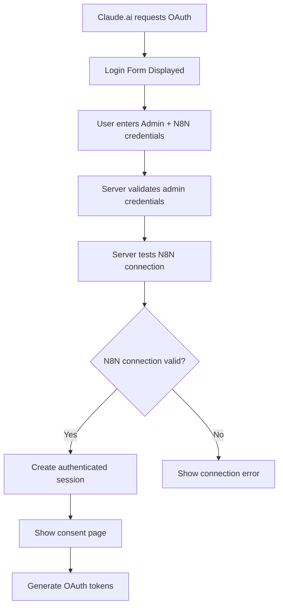

# N8N MCP Server Configuration Guide

## Enhanced Authentication System

The N8N MCP Server now features a **dynamic configuration system** that allows users to connect to their own N8N instances during the authentication process.

## Features

### ✅ **Multi-User Capability**
- **Universal MCP Server**: One server can connect to multiple N8N instances
- **Per-Session Configuration**: Each login can configure different N8N connections
- **Secure Isolation**: N8N credentials are stored per session, not globally

### ✅ **Dynamic Login Form**
The authentication form now includes:

1. **Admin Credentials**:
   - Username: `admin` 
   - Password: `a0506a70dbaf3486014ceac508d7db2d7607fba8`

2. **N8N Connection Details**:
   - **N8N Host URL**: Your N8N instance URL (e.g., `https://your-n8n-instance.com`)
   - **N8N API Key**: Your N8N API key for authentication

### ✅ **Connection Validation**
- **Real-time Testing**: Server tests N8N connection during login
- **Immediate Feedback**: Invalid connections show specific error messages
- **Secure Authentication**: Only proceeds if both admin auth AND N8N connection succeed

## Usage Examples

### Example 1: Personal N8N Instance
```
Admin Username: admin
Admin Password: a0506a70dbaf3486014ceac508d7db2d7607fba8
N8N Host URL: https://my-n8n.example.com
N8N API Key: eyJhbGciOiJIUzI1NiIsInR5cCI6IkpXVCJ9...
```

### Example 2: Cloud N8N Instance  
```
Admin Username: admin
Admin Password: a0506a70dbaf3486014ceac508d7db2d7607fba8
N8N Host URL: https://app.n8n.cloud
N8N API Key: n8n_api_12345678901234567890...
```

### Example 3: Self-Hosted N8N
```
Admin Username: admin
Admin Password: a0506a70dbaf3486014ceac508d7db2d7607fba8
N8N Host URL: https://workflows.mycompany.com
N8N API Key: my-custom-api-key-here
```

## How It Works

### 1. **Authentication Flow**


### 2. **Session Management**
- **Admin Session**: 30-minute lifespan with admin authentication
- **N8N Connection**: Stored securely within the session
- **MCP Tools**: Use session-specific N8N connection for all API calls

### 3. **Security Features**
- **Credential Isolation**: Each session has isolated N8N credentials
- **Connection Testing**: Validates N8N connectivity before proceeding
- **Session Expiry**: Automatic cleanup of expired sessions
- **Secure Storage**: Credentials never logged or exposed

## Error Handling

### Admin Authentication Errors
- **Invalid Username/Password**: Shows retry form with error message
- **Session Expired**: Redirects to fresh login form

### N8N Connection Errors
- **Invalid Host URL**: "N8N API error: 404 Not Found"
- **Invalid API Key**: "N8N API error: 401 Unauthorized"  
- **Network Issues**: "N8N API error: Connection refused"
- **Invalid Endpoint**: "N8N API error: 500 Internal Server Error"

## Configuration Options

### Environment Variables (Optional)
You can still set default values via environment variables:

```bash
# Default N8N connection (optional)
N8N_BASE_URL=https://your-default-n8n.com
N8N_API_KEY=your-default-api-key

# Admin credentials (required)
ADMIN_USERNAME=admin  
ADMIN_PASSWORD=your-secure-password
```

### Docker Compose Configuration
```yaml
environment:
  - ADMIN_USERNAME=admin
  - ADMIN_PASSWORD=your-secure-password
  # N8N defaults (optional - can be overridden via login form)
  - N8N_BASE_URL=https://your-n8n.com
  - N8N_API_KEY=your-api-key
```

## Available MCP Tools

Once authenticated with valid N8N credentials, all tools use the session-specific connection:

1. **`get_workflows`** - List all workflows from your N8N instance
2. **`get_workflow`** - Get specific workflow details  
3. **`create_workflow`** - Create new workflows
4. **`activate_workflow`** - Activate workflows
5. **`deactivate_workflow`** - Deactivate workflows
6. **`execute_workflow`** - Execute workflows manually
7. **`get_executions`** - View execution history

## Security Considerations

### ✅ **Secure by Design**
- **No Global State**: N8N credentials never stored globally
- **Session Isolation**: Each user session is completely isolated
- **Credential Validation**: Real-time testing of N8N connections
- **Automatic Cleanup**: Sessions and credentials expire automatically

### ✅ **Production Ready**
- **HTTPS Only**: All communication encrypted
- **Secure Cookies**: HttpOnly, Secure, SameSite protection
- **CORS Protection**: Proper cross-origin resource sharing
- **Input Validation**: All user inputs validated and sanitized

## Deployment

The enhanced server is ready for production deployment with:

```bash
# Build and deploy
docker-compose build n8n-mcp-server
docker-compose up -d n8n-mcp-server

# Test the system
curl https://your-domain.com/health

# Access OAuth discovery
curl https://your-domain.com/.well-known/oauth-authorization-server
```

## Troubleshooting

### Login Issues
1. **Check admin credentials** - Ensure username/password are correct
2. **Verify N8N connectivity** - Test your N8N instance directly
3. **Check API key** - Ensure your N8N API key has proper permissions
4. **Review server logs** - `docker logs n8n-mcp-server`

### Connection Issues  
1. **N8N URL format** - Must include `https://` prefix
2. **API key format** - Check N8N documentation for correct format
3. **Network access** - Ensure MCP server can reach your N8N instance
4. **N8N API enabled** - Verify N8N public API is enabled

This enhanced system provides maximum flexibility while maintaining security and ease of use! 🚀