# N8N MCP Server for Claude.ai Web Integration

🚀 **First-ever working MCP server that brings N8N workflow automation directly to Claude.ai web interface**

This breakthrough implementation enables Claude.ai to directly manage N8N workflows through a secure, multi-tenant MCP server with OAuth 2.1 authentication. Unlike desktop-only solutions, this server works entirely through HTTP streaming, making N8N accessible from any Claude.ai web session.

## 📚 Table of Contents

- [🎯 What Makes This Special](#-what-makes-this-special)
- [✨ Features](#-features)  
- [🛠️ Available Tools](#️-available-tools)
- [🚀 Quick Start](#-quick-start)
- [⚙️ Configuration](#️-configuration)
- [🔐 Authentication Flow](#-authentication-flow)
- [🚀 Production Deployment](#-production-deployment)
- [🏗️ Architecture](#️-architecture)
- [🔧 Troubleshooting](#-troubleshooting)
- [🤝 Contributing](#-contributing)
- [💬 Support](#-support)

## 🎯 What Makes This Special

- 🌐 **Web-First Design**: Works with Claude.ai web interface (not just desktop)
- 🔬 **Protocol Breakthrough**: Solves Claude.ai's non-standard MCP implementation  
- 🏢 **Multi-Tenant Architecture**: Multiple users, multiple N8N instances
- 🚀 **Production Ready**: Docker deployment with Traefik integration
- 🔓 **Universal Access**: Connect any N8N instance dynamically


*Visual: Claude.ai seamlessly integrated with N8N workflows*

## ✨ Features

- 🔐 **OAuth 2.1 Authentication** - Secure authentication flow for Claude.ai integration
- 🔄 **Dynamic N8N Configuration** - Enter any N8N instance credentials during login
- 📋 **Comprehensive Workflow Management** - Create, read, update, delete, and execute workflows
- ⚡ **Real-time Execution Control** - Start, stop, and monitor workflow executions
- 👥 **Multi-tenant Support** - Each user session maintains separate N8N credentials
- 🐳 **Docker Ready** - Containerized deployment with Traefik integration

## 🛠️ Available Tools

The MCP server provides 9 N8N tools for workflow automation:

### 📋 Workflow Management
- 📝 `get_workflows` - List all workflows
- 🔍 `get_workflow` - Get specific workflow details
- ➕ `create_workflow` - Create new workflows
- ✏️ `update_workflow` - Update existing workflows
- 🗑️ `delete_workflow` - Delete workflows
- ▶️ `activate_workflow` - Activate workflows
- ⏸️ `deactivate_workflow` - Deactivate workflows

### ⚡ Execution Management
- 🚀 `execute_workflow` - Execute workflows manually
- 📊 `get_executions` - View execution history and status

## 🚀 Quick Start

> 📸 **Screenshots coming soon!** We'll add visual guides showing the complete setup process.


*Screenshot: Claude.ai successfully managing N8N workflows*

### 1️⃣ Clone and Setup

```bash
git clone https://github.com/yourusername/n8nmcp.git
cd n8nmcp
cp .env.example .env
```

### 2️⃣ Configure Environment

Edit `.env` file with your settings:
```bash
# Required
ADMIN_USERNAME=admin
ADMIN_PASSWORD=your-secure-password-hash
SERVER_URL=https://your-domain.com
CORS_ORIGIN=https://claude.ai

# Optional (can be set via login form)
N8N_HOST=https://your-n8n-instance.com
N8N_API_KEY=your-n8n-api-key
```

### 3️⃣ Deploy with Docker

```bash
# Make sure you're in the n8nmcp directory
docker-compose up -d

# Check logs
docker logs n8n-mcp-server -f
```

### 4️⃣ Integrate with Claude.ai


*Screenshot: Adding MCP integration in Claude.ai*

1. **Open Claude.ai** → Settings → Integrations
2. **Add Custom Integration**:
   - Name: `N8N Workflow Manager`
   - URL: `https://your-domain.com/`
   - Type: `MCP Server`
3. **Authenticate**: Login with admin credentials
4. **Connect N8N**: Enter your N8N instance URL and API key
5. **Start Using**: Ask Claude to list your workflows!

### 5️⃣ First Test


*Screenshot: Claude.ai displaying N8N workflows*

```
Ask Claude: "Can you list my N8N workflows?"
```

## ⚙️ Configuration

### 🔧 Environment Variables

| Variable | Description | Required |
|----------|-------------|----------|
| `PORT` | Server port (default: 3007) | No |
| `HOST` | Server host (default: 0.0.0.0) | No |
| `ADMIN_USERNAME` | Admin login username | Yes |
| `ADMIN_PASSWORD` | Admin password hash | Yes |
| `N8N_HOST` | Default N8N instance URL | No* |
| `N8N_API_KEY` | Default N8N API key | No* |
| `CORS_ORIGIN` | Allowed CORS origins | Yes |

*N8N credentials can be provided via environment variables as fallback or entered dynamically during login.

### 🐳 Docker Compose

The included `docker-compose.yml` provides:
- N8N MCP Server container
- Traefik reverse proxy integration
- Automatic SSL certificates
- Health checks

## 🔐 Authentication Flow


*Diagram: Complete OAuth 2.1 authentication process*

1. **OAuth Authorization** - Claude.ai redirects to authorization endpoint
2. **Admin Login** - Enter admin credentials and N8N instance details
3. **Consent Page** - Review and approve access permissions
4. **Token Exchange** - OAuth 2.1 PKCE flow completes
5. **Session Management** - Server maintains session with N8N credentials

## 🌐 API Endpoints

| Endpoint | Method | Description |
|----------|--------|-------------|
| `/` | GET/POST | MCP protocol endpoint |
| `/health` | GET | Health check |
| `/oauth/authorize` | GET | OAuth authorization |
| `/oauth/token` | POST | Token exchange |
| `/oauth/login` | POST | Admin authentication |
| `/.well-known/oauth-authorization-server` | GET | OAuth discovery |

## 🛡️ Security Features

- **OAuth 2.1 with PKCE** - Modern authentication standard
- **Session Isolation** - Each user session maintains separate credentials
- **Secure Credential Storage** - N8N credentials stored per-session, not globally
- **CORS Protection** - Configurable origin restrictions
- **Environment Variable Protection** - Sensitive data via environment variables

## 💻 Development

### 🏠 Local Development

```bash
npm install
npm start
```

### 🧪 Testing

```bash
# Test MCP tools directly
curl -X POST http://localhost:3007/ \
  -H "Content-Type: application/json" \
  -H "Authorization: Bearer your-token" \
  -d '{"jsonrpc":"2.0","id":1,"method":"tools/list","params":{}}'
```

## 🚀 Production Deployment


*Diagram: Production deployment with Traefik, Docker, and SSL*

### 📋 Prerequisites

- Domain name with DNS pointing to your server
- Docker and Docker Compose installed
- Traefik proxy running (or configure your own reverse proxy)

### 📝 Step-by-Step Deployment

1. **Server Setup**
```bash
# Clone to your server
git clone https://github.com/yourusername/n8nmcp.git
cd n8nmcp

# Configure environment
cp .env.example .env
nano .env  # Edit with your settings
```

2. **Environment Configuration**
```bash
# Generate secure password hash
node -e "console.log(require('crypto').createHash('sha256').update('your-password').digest('hex'))"

# Update .env file
SERVER_URL=https://your-domain.com
ADMIN_USERNAME=admin
ADMIN_PASSWORD=generated-hash-above
CORS_ORIGIN=https://claude.ai
```

3. **Deploy with Docker**
```bash
# Add to existing docker-compose.yml or create new one
docker-compose up -d

# Verify deployment
docker ps | grep n8n-mcp
docker logs n8n-mcp-server
```

4. **SSL/Domain Setup** (if using Traefik)
```yaml
# Already configured in docker-compose.yml
labels:
  - "traefik.enable=true"
  - "traefik.http.routers.n8n-mcp.rule=Host(`your-domain.com`)"
  - "traefik.http.routers.n8n-mcp.entrypoints=websecure"
  - "traefik.http.routers.n8n-mcp.tls.certresolver=mytlschallenge"
```

5. **Test Deployment**
```bash
# Health check
curl https://your-domain.com/health

# OAuth discovery
curl https://your-domain.com/.well-known/oauth-authorization-server
```

## 🏗️ Architecture


*Diagram: Complete system architecture and data flow*

```mermaid
graph TD
    A[👤 Claude.ai User] --> B[🔐 OAuth 2.1 Flow]
    B --> C[🖥️ N8N MCP Server]
    C --> D[📊 Session Management]
    D --> E[🔑 Per-User N8N Credentials]
    E --> F[🤖 N8N Instance]
    
    style A fill:#4A90E2
    style B fill:#28A745
    style C fill:#17A2B8
    style D fill:#6F42C1
    style E fill:#FFC107
    style F fill:#DC3545
```




## 🤝 Contributing

1. Fork the repository
2. Create a feature branch
3. Make your changes
4. Add tests
5. Submit a pull request

## 🔧 Troubleshooting


*Screenshot: Debug console showing MCP protocol messages*

### ⚠️ Common Issues

**🚫 Tools not appearing in Claude.ai**
```bash
# Check authentication
docker logs n8n-mcp-server | grep "AUTH"

# Verify OAuth flow
curl https://your-domain.com/.well-known/oauth-authorization-server

# Test tool discovery
docker logs n8n-mcp-server | grep "tools/list"
```

**⏱️ Connection timeouts**
```bash
# Check server connectivity
curl -I https://your-domain.com/health

# Verify SSL certificate
openssl s_client -connect your-domain.com:443 -servername your-domain.com

# Check Docker networking
docker network ls
docker logs traefik | grep your-domain.com
```

**🔑 N8N API errors**
```bash
# Test N8N connectivity directly
curl -H "Authorization: Bearer your-api-key" https://your-n8n.com/api/v1/workflows

# Check API key permissions in N8N settings
# Verify N8N instance is accessible from Docker network
```

**🔧 Response size issues**
- Large workflow lists may cause timeouts
- Server automatically truncates responses to prevent this
- Check logs for "Response truncated" messages

### 🐛 Debug Commands

```bash
# Complete server logs
docker logs n8n-mcp-server -f

# Filter for errors only
docker logs n8n-mcp-server 2>&1 | grep -E "(ERROR|error|Error)"

# Check authentication flow
docker logs n8n-mcp-server 2>&1 | grep -E "(oauth|auth|session)"

# Monitor MCP protocol
docker logs n8n-mcp-server 2>&1 | grep -E "(MCP|tools|prompts)"
```

### 🆘 Getting Help

If you're still having issues:

1. **Check GitHub Issues**: Look for similar problems
2. **Enable Debug Logging**: Set `DEBUG=true` in environment
3. **Share Logs**: Include relevant log snippets (remove sensitive data)
4. **Describe Setup**: OS, Docker version, domain configuration

## 📄 License

MIT License - see LICENSE file for details

## 💬 Support


*We're here to help! Open an issue for support.*

- GitHub Issues: Report bugs and feature requests
- Documentation: See docs/ directory
- Examples: See examples/ directory